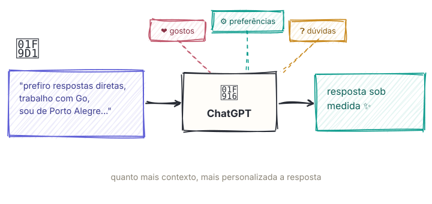
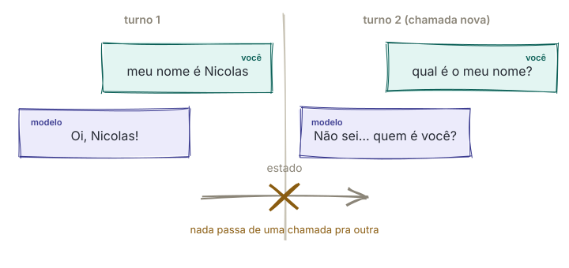
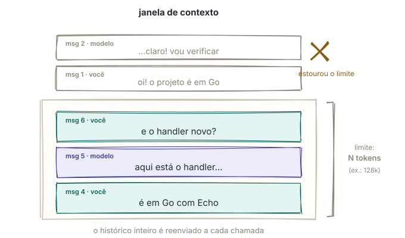
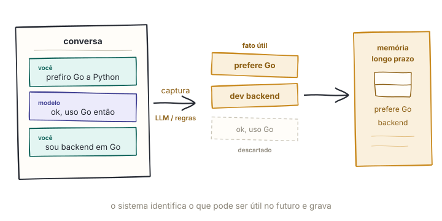
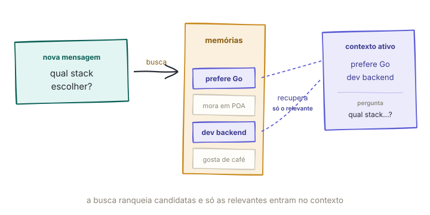
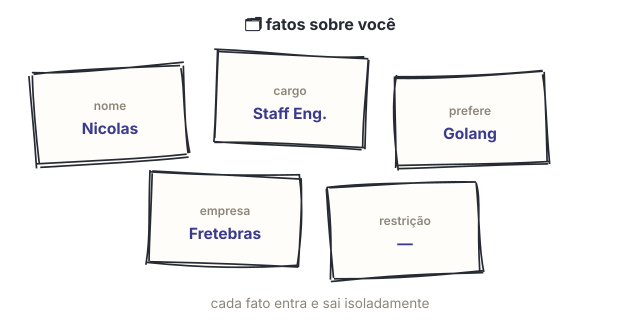
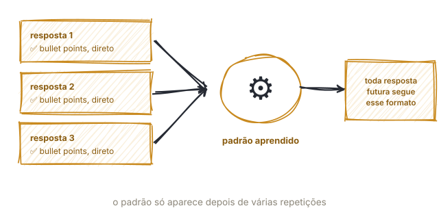
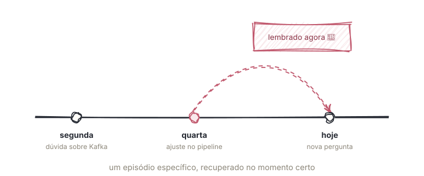

> *Spoiler: não sei como a OpenAI implementa cada detalhe por dentro. O ChatGPT é o gancho; o assunto de verdade é como a memória funciona em sistemas de agentes.*

*Como Porto-alegrense, o mais correto seria "Como o ChatGPT lembra de ti?", mas prometo tentar aplicar os vícios de linguagem (e todos corretos obviamente) no restante do texto.*

Você já deve ter percebido: quanto mais compartilha seus gostos, preferências e dúvidas, mais o ChatGPT parece saber sobre você e mais as respostas combinam com o seu dia a dia.



Mas como isso funciona? O modelo está sendo treinado em tempo real com cada conversa? Não. O uso de conversas para melhorar modelos, quando aplicável, é um processo separado. O que explica essa continuidade durante o uso é outra coisa: a **memória** do sistema ao redor do modelo.

## O modelo não sabe quem é você

O modelo, isoladamente, é `stateless`: uma chamada não leva consigo um estado pessoal oculto deixado pela chamada anterior. Para continuar uma conversa, a aplicação precisa guardar o que aconteceu e enviar novamente as partes relevantes a cada nova chamada.

Os parâmetros do modelo carregam padrões aprendidos durante o treinamento, mas não um cadastro atualizado de cada pessoa/entidade. O modelo não sabe que o Nicolas trabalhou com Golang e usa Linux, a menos que essa informação chegue no contexto da chamada.



O sistema construído ao redor dele, porém, pode ser *stateful*. Em geral, essa memória é organizada por escopo:

- **curto prazo**: acompanha uma conversa ou *thread/session*;
- **longo prazo**: atravessa conversas e pode ser compartilhada entre *threads/sessions*.

A diferença principal é o ciclo de vida da informação e onde ela pode ser recuperada. O trabalho do sistema é selecionar o que importa e montar o contexto que o modelo verá agora.

## Memórias de curto prazo

A memória de curto prazo é o estado associado à conversa atual: mensagens, resultados de ferramentas e outros dados necessários para continuar aquele fluxo. Esse estado pode até ser persistido em um banco para que a conversa seja retomada depois. Ainda assim, o modelo só enxerga, em cada chamada, a parte que a aplicação colocou na janela de contexto ativa. Na implementação mais simples, todo o histórico que cabe nessa janela é reenviado.

Enquanto a conversa avança, o histórico cresce. Se você contar, no início, que o projeto usa *Golang* com *Echo* e pedir um *handler* dez mensagens depois, o modelo ainda saberá qual stack usar se essa informação continuar no contexto enviado, caso contrário, ele pode te responder em `Python` por exemplo.



O estado persistido pode continuar crescendo, mas sua parte ativa tem um limite: a janela de contexto aceita uma quantidade máxima de tokens. Quando o histórico se aproxima do limite, a aplicação precisa escolher o que entra. As estratégias mais comuns, que podem ser combinadas, são:

- Descartar mensagens antigas.
- Manter as mensagens mais recentes que cabem no contexto.
- Substituir trechos antigos por um resumo.
- Buscar no histórico apenas mensagens relacionadas à pergunta atual.


É verdade que hoje em dia os modelos aceitam contextos cada vez maiores, dessa forma, por que não enviar tudo? Porque contexto continua tendo custo, mais tokens aumentam preço e latência, e informação irrelevante reduz a relação entre sinal e ruído. O custo exato depende da arquitetura e das otimizações do provedor, mas a regra prática permanece: uma janela maior não elimina a necessidade de selecionar bem o contexto.

## Memórias de longo prazo

A memória de longo prazo guarda informações que devem sobreviver à conversa atual e ficar disponíveis em outras *threads*. Ela pode registrar preferências do usuário, fatos sobre um projeto, instruções de comportamento ou experiências anteriores.

É essa camada que permite ao agente lembrar, numa conversa nova, que você prefere respostas objetivas, que trabalha com agentes de IA ou que já investigou determinado assunto na semana passada.

O modelo não carrega nada disso "na cabeça". De forma geral, a arquitetura de uma memória de longo prazo, se organiza em quatro etapas: **captura**, **armazenamento**, **recuperação** e **injeção**.

### Captura

Durante ou depois da conversa, regras da aplicação e, muitas vezes, um LLM identificam o que pode ser útil no futuro. A gravação pode acontecer no caminho da resposta ou em segundo plano. Uma *tool call* é uma forma de persistir a memória, não uma exigência.



### Armazenamento

Cada memória pode virar um item em uma tabela, documento, armazenamento chave-valor ou índice vetorial. Além do conteúdo, sistemas reais costumam registrar escopo, origem e datas para saber a quem a memória pertence e como atualizá-la:

```json
{
  "id": "mem-193",
  "scope": "user:nicolas",
  "content": "O Nicolas é dev backend, prefere Go a Python",
  "type": "semantic",
  "updated_at": "2026-08-25T14:03:00Z",
  "source": "conv-8412"
}
```

Um *embedding* pode ser armazenado ou indexado junto desse registro quando a aplicação precisa de busca semântica.

### Recuperação

Quando uma nova mensagem chega, o sistema procura memórias candidatas dentro do escopo correto e decide quais são relevantes. Busca vetorial por similaridade é uma opção, mas raramente deveria ser o único sinal. Filtros de usuário e projeto, palavras-chave, recência, importância, confiança e regras de negócio também podem participar do ranking.

Se você pergunta "qual stack escolher para este serviço?", a preferência por Go pode ser recuperada pela proximidade semântica. Um limite de relevância e um orçamento de tokens evitam que toda memória vagamente relacionada seja enviada ao modelo.



### Injeção

Os registros escolhidos entram no contexto da chamada. Dependendo da arquitetura, podem aparecer no *system prompt*, em uma mensagem própria ou no resultado de uma ferramenta:

```text
Memórias relevantes para esta resposta:
- O Nicolas é dev backend, prefere Go a Python
- Responder com código primeiro, explicação depois
- Em 18/08, debugou uma race condition num pipeline de Kafka
```

No momento em que é recuperada, a memória de longo prazo vira contexto ativo. A diferença está na origem, no escopo e na capacidade de sobreviver entre conversas.

### E no ChatGPT?

Segundo a [documentação da OpenAI](https://help.openai.com/en/articles/8590148-memory-faq), a memória do ChatGPT usa duas fontes:

- **Memórias salvas**: detalhes que você pediu para lembrar ou que o produto decidiu guardar. Ficam separadas do histórico de conversas.
- **Referência ao histórico de chats**: informações úteis extraídas de conversas anteriores, sem a promessa de reter cada detalhe.

A OpenAI também chama de [*dreaming*](https://openai.com/index/chatgpt-memory-dreaming/) o processo em segundo plano que sintetiza contexto do histórico para manter essa memória relevante e atualizada. Os controles ficam em *Configurações → Personalização → Memória*, e o *Chat temporário* não consulta nem cria memórias.

Isso descreve o comportamento público do produto, não sua implementação interna. Não dá para concluir, por exemplo, que o ChatGPT usa exatamente o esquema JSON ou o pipeline de busca vetorial mostrado acima.

## Tipos de memória

Curto e longo prazo respondem à pergunta "por quanto tempo e em qual escopo essa informação existe?". Outra classificação responde "que tipo de informação é essa?". Nela, memórias de agentes costumam ser divididas em **semânticas**, **procedurais** e **episódicas**.

### Memória semântica

É a memória de fatos e generalizações: seu nome, sua profissão, suas preferências declaradas ("prefiro respostas curtas") ou suas restrições ("sou vegetariano"). No nosso exemplo: `"O Nicolas é dev backend, prefere Go a Python"`.

No ChatGPT, parte das memórias salvas se parece com esse tipo, embora a taxonomia conceitual não corresponda necessariamente à estrutura interna do produto.

"Fato", aqui, não é sinônimo de "verdade eterna". É o retrato mais atual que o sistema tem, e retratos ficam desatualizados.

Se você troca de emprego ou muda de cidade, o fato antigo não deveria disputar espaço com o novo como se ambos fossem atuais. Sistemas de memória precisam de uma política de atualização que combine **recência**, **origem**, **confiança**, correções explícitas do usuário e **resolução de entidades**, por exemplo, reconhecer que "o Nicolas mora em Porto Alegre" e "o Nicolas se mudou para Florianópolis" falam da mesma pessoa e do mesmo atributo.

A memória semântica pode ser uma coleção de fatos independentes ou um perfil consolidado. Em ambos os casos, a parte difícil não é guardar: é decidir *quando atualizar, combinar ou remover*.



### Memória procedural

É a memória de *como agir*. Em vez de representar apenas fatos, ela guarda instruções, regras, habilidades e padrões de comportamento.

Exemplos: como você gosta que as respostas sejam formatadas, se prefere código direto ou com explicação e se costuma pedir uma revisão antes de aplicar qualquer mudança. No nosso agente de programação: `"Responder com código primeiro, explicação depois"`.

Uma memória procedural pode ser explícita, o usuário pede uma vez que o agente sempre revise antes de editar ou inferida a partir de interações repetidas. O desafio é não transformar uma escolha pontual em regra permanente e manter essas instruções versionadas quando o comportamento desejado mudar.

É fácil confundi-la com memória semântica: "Nicolas prefere respostas objetivas" é um fato sobre o usuário; quando o sistema traduz isso para "responda de forma objetiva", vira uma instrução procedural.



### Memória episódica

É a memória de eventos e experiências específicas: o que aconteceu, em que contexto, quais decisões foram tomadas e qual foi o resultado.

Não é "o Nicolas trabalha com Go", isso é semântico. É "na conversa de terça passada, o Nicolas estava investigando uma *race condition* no pipeline de Kafka".

Essa camada dá continuidade entre conversas e também pode servir de exemplo para resolver um problema parecido no futuro. Ainda assim, o registro não é sagrado: um episódio pode ser corrigido, resumido ou removido. Preservar sua origem ajuda o sistema a distinguir o que realmente aconteceu de uma interpretação gerada depois.



## Estratégia: o que vale a pena armazenar?

Ao desenhar a memória de um agente, a primeira pergunta não é "qual banco vetorial devo usar?", mas "que decisão futura melhora se eu guardar isso?". Depois, o tipo e o ciclo de vida ficam mais claros:

- Se representa o estado atual de algo, como cidade, cargo ou preferência, é **semântica**. Defina quem pode atualizá-la e como resolver conflitos.
- Se registra uma ocorrência ou solução passada, é **episódica**. Preserve contexto e origem, e deixe sua relevância diminuir com o tempo.
- Se orienta como o agente deve agir, é **procedural**. Dê a ela escopo, prioridade e versão.

Os tipos também conversam entre si. Um conjunto de episódios pode sustentar uma generalização semântica. Se o agente registra "perguntou sobre *consumers* de Kafka", "perguntou sobre *offsets*" e "perguntou sobre rebalanceamento", pode propor a memória `"O Nicolas trabalha com streaming"`. Os episódios são a evidência; a memória semântica é uma conclusão que ainda pode precisar de confirmação.

## Esquecer também faz parte

Nem tudo deveria ser lembrado. Persistir memória tem custo de armazenamento, governança e, quando há recuperação, latência. Cada item injetado também ocupa tokens. O pior custo é o de **qualidade**: memórias irrelevantes, desatualizadas ou contraditórias disputam espaço com a conversa real e confundem o modelo em vez de ajudar.

Antes de guardar algo, vale perguntar:

- Isso será útil em uma decisão futura?
- O usuário espera e autoriza que essa informação seja lembrada?
- Qual é o escopo correto: conversa, projeto, equipe ou usuário?
- Como essa memória será corrigida, expirada ou apagada?

Um bom sistema de memória não é o que acumula mais dados. É o que guarda a informação certa, recupera no momento certo e sabe esquecer.

## Conclusão

O modelo não lembra de você sozinho. A continuidade surge porque o sistema ao redor dele persiste estado, seleciona informações e as apresenta novamente como contexto.

Memória de curto prazo mantém o fio da conversa. Memória de longo prazo atravessa conversas. Memórias semânticas guardam fatos, episódicas registram experiências e procedurais orientam comportamento. A arquitetura funciona bem quando essas categorias ajudam o agente a decidir o que lembrar.

## Onde se aprofundar

- [Memory FAQ — OpenAI](https://help.openai.com/en/articles/8590148-memory-faq)
- [Dreaming: Better memory for a more helpful ChatGPT — OpenAI](https://openai.com/index/chatgpt-memory-dreaming/)
- [Memory — LangChain](https://docs.langchain.com/oss/python/concepts/memory)
- [Compaction — Letta](https://docs.letta.com/guides/core-concepts/messages/compaction/)
- [Cognitive Architectures for Language Agents (CoALA)](https://arxiv.org/abs/2309.02427)
- [MemGPT](https://arxiv.org/abs/2310.08560)
- [Generative Agents](https://arxiv.org/abs/2304.03442)
- [Mem0](https://arxiv.org/abs/2504.19413)